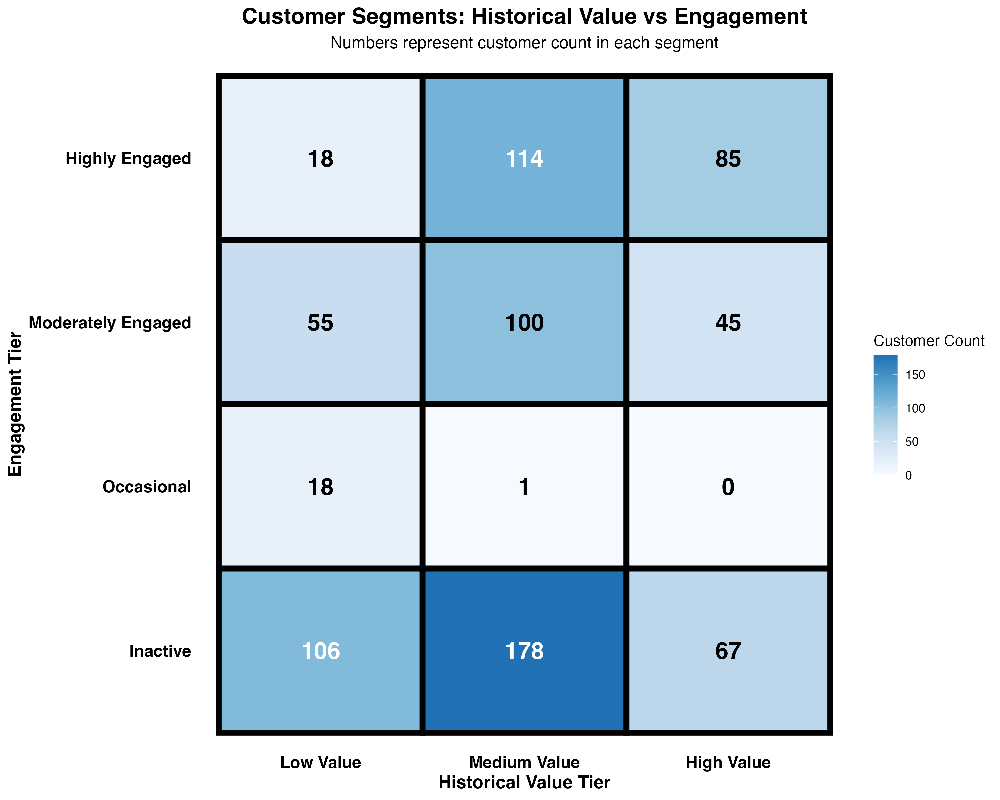
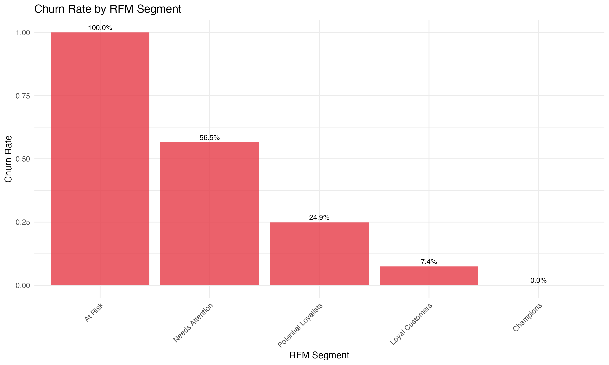
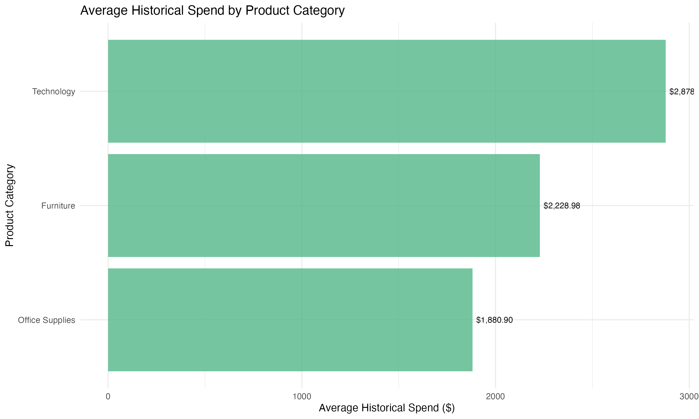
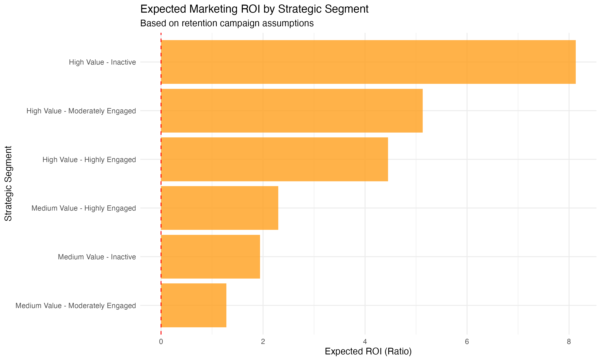

# Superstore Predictive Customer Analytics - Feasibility Assessment

This project explores the **feasibility of predictive modeling** for customer behavior forecasting, building on insights from [Superstore RFM Customer Segmentation](https://github.com/moneteer808-oss/Superstore-RFM-Customer-Segmentation).  
The analysis reveals fundamental data limitations and successfully **pivots to descriptive analytics** for actionable business insights.

## Key Findings
- **Predictive modeling limitations identified**: All correlations with future spend < 0.06
- **Strategic pivot to descriptive analytics**: RFM segmentation provides reliable business value
- **Actionable customer segments**: High-value at-risk customers identified for immediate action
- **Technology category superiority**: Highest spend and lowest churn rates

## Analytical Journey
1. **Predictive Modeling Exploration**: Attempted churn and CLV prediction
2. **Feasibility Assessment**: Discovered weak predictive signals in the data
3. **Strategic Pivot**: Successfully delivered value through descriptive segmentation
4. **Business Insights**: Customer prioritization and marketing recommendations

## Outputs
- `customer_analytics_comprehensive.csv`: Complete customer intelligence dataset
- `high_priority_customers.csv`: Immediate action required customer list
- `marketing_strategy_recommendations.csv`: Data-driven action plan
- `methodology_notes.txt`: Detailed feasibility assessment documentation

## Visual Highlights  
Key insights from the descriptive analytics approach:

| Visualization | Description |
|----------------|--------------|
|  | Strategic segments based on historical value and engagement |
|  | Churn analysis across RFM segments |
|  | Product category value comparison |
|  | Expected marketing return by segment |

## Data Source
Dataset: [Superstore Sales Dataset (Kaggle)](https://www.kaggle.com/datasets/vivek468/superstore-dataset-final/data)  
**Disclaimer:** This dataset is owned by the original author on Kaggle and used here **strictly for educational purposes**.

---

### Tech Stack
- R, Tidyverse, ggplot2  
- Statistical analysis and feasibility assessment

---

### Project Objective
Comprehensive analysis that:
1. **Explored predictive modeling** feasibility for customer behavior
2. **Identified data limitations** through rigorous correlation analysis  
3. **Successfully pivoted** to descriptive analytics for business value
4. **Delivered actionable insights** through customer segmentation

---

### Learning Journey
- **Previous**: [Superstore RFM Customer Segmentation](https://github.com/moneteer808-oss/Superstore-RFM-Customer-Segmentation)
- **Next**: [Customer Analytics - Python Implementation](https://github.com/moneteer808-oss/Customer-Analytic-Python) (Successful pivot implementation)

---

### Key Learning
This project demonstrates mature analytical judgment: knowing when **not** to use advanced models is as important as knowing when to use them.

---

© 2025 Moneteer808@gmail.com — For educational use only.

