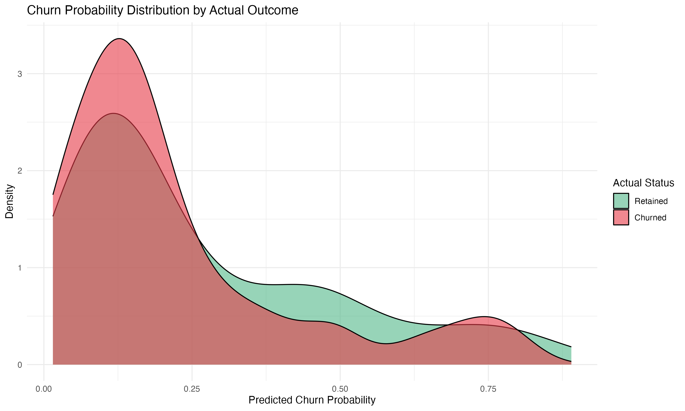
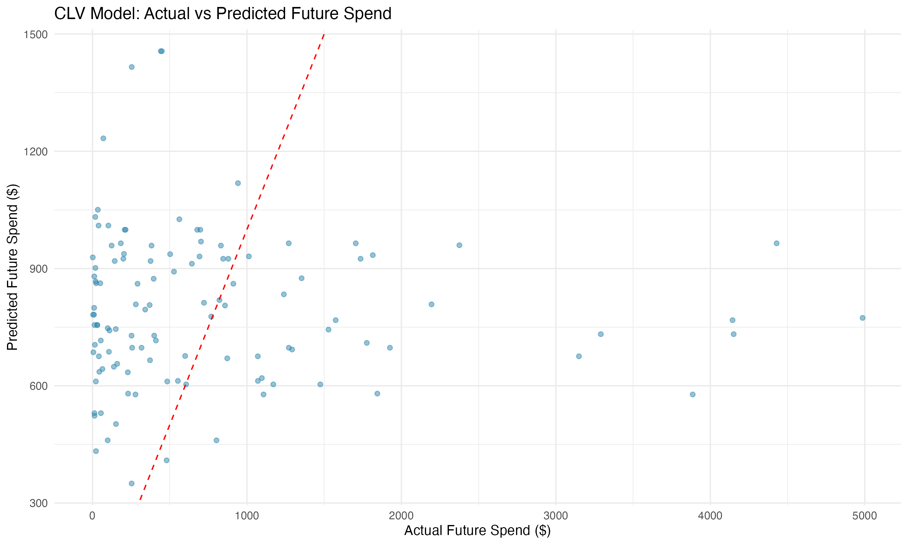
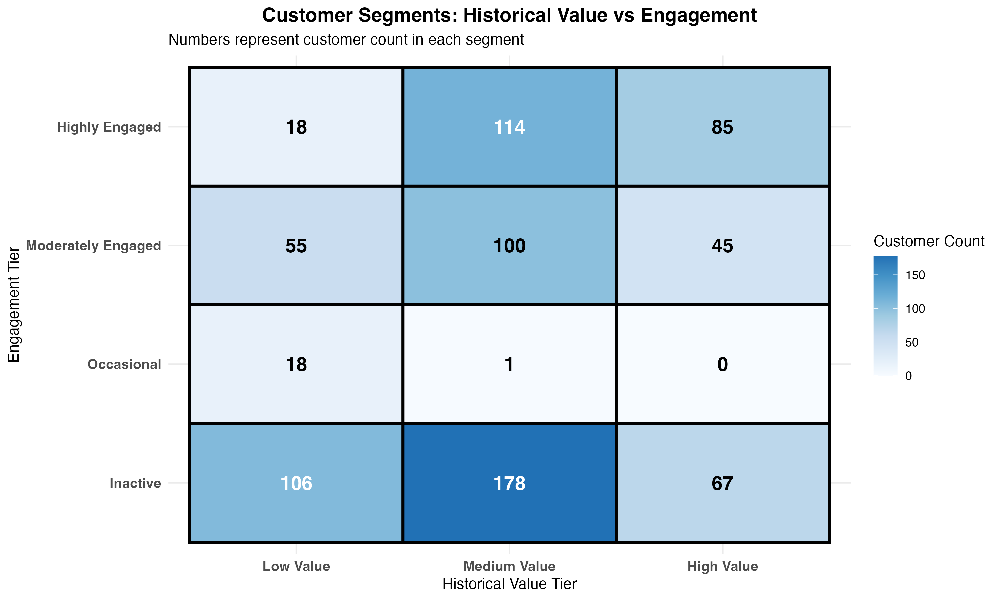
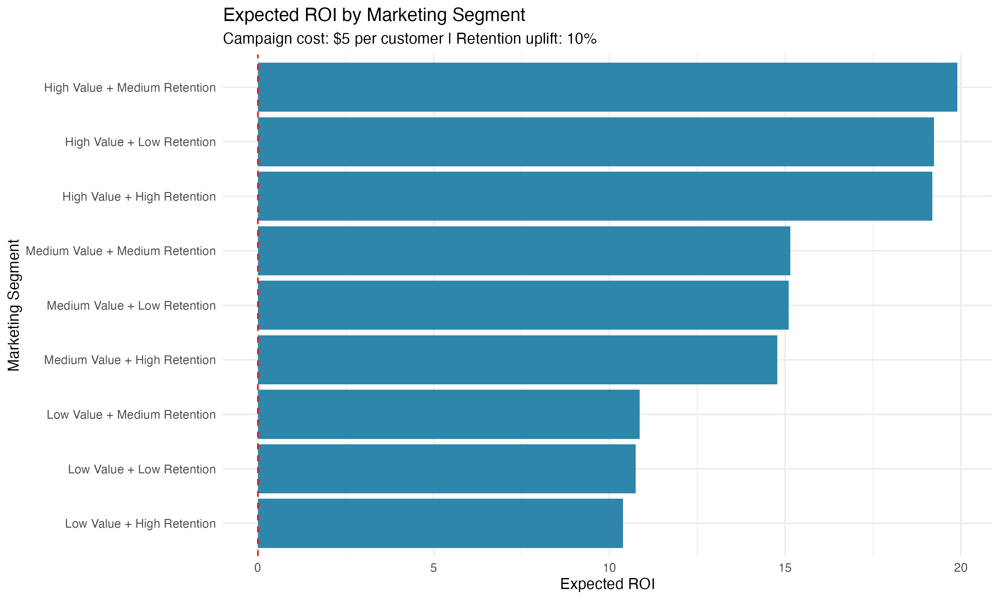

# Superstore Predictive Customer Analytics

This project extends the insights from [Superstore RFM Customer Segmentation](https://github.com/moneteer808-oss/Superstore-RFM-Customer-Segmentation) by applying **predictive analytics** to forecast **customer churn** and **lifetime value (CLV)**.  
It combines machine learning models with RFM segmentation to support **marketing strategy and ROI optimization**.

## Key Features
- Clean, modular R workflow for predictive modeling
- Churn probability and CLV prediction using regression and classification
- Customer-level probability and value scoring
- Integrated RFM + Predictive segmentation for business decisions

## Outputs
- `churn_predictions.csv`: Customer churn likelihoods  
- `clv_predictions.csv`: Predicted customer lifetime value  
- `predictive_customer_segments.csv`: Combined RFM + predictive segment classifications  
- `Superstore_Predictive_Customer_Analytics.html`: Interactive HTML report  

## Visual Highlights  
Key insights generated from the predictive analytics pipeline:

| Visualization | Description |
|----------------|--------------|
|  | Probability density of churn likelihoods across customer groups |
|  | Regression comparison between predicted and actual CLV |
|  | Matrix combining retention risk and predicted value tiers |
|  | Estimated marketing ROI per segment for campaign planning |

> **Previous Project:** [Superstore RFM Customer Segmentation](https://github.com/moneteer808-oss/Superstore-RFM-Customer-Segmentation)  
> This RFM segmentation serves as the foundation for all predictive modeling and strategy simulations.

## Data Source
Dataset: [Superstore Sales Dataset (Kaggle)](https://www.kaggle.com/datasets/vivek468/superstore-dataset-final/data)  
**Disclaimer:** This dataset is owned by the original author on Kaggle and used here **strictly for educational purposes**.

---

### Tech Stack
- R, Tidyverse, Caret, RandomForest, XGBoost  
- R Markdown, Shiny, ggplot2  

---

### Project Objective
Develop a unified customer intelligence system that:
1. Predicts customer churn risk  
2. Estimates customer lifetime value (CLV)  
3. Integrates both predictions with RFM segments  
4. Prioritizes marketing spend based on expected ROI

---

### Related Repository
- [Superstore RFM Customer Segmentation](https://github.com/moneteer808-oss/Superstore-RFM-Customer-Segmentation)

---

© 2025 Moneteer808@gmail.com — For educational use only.

